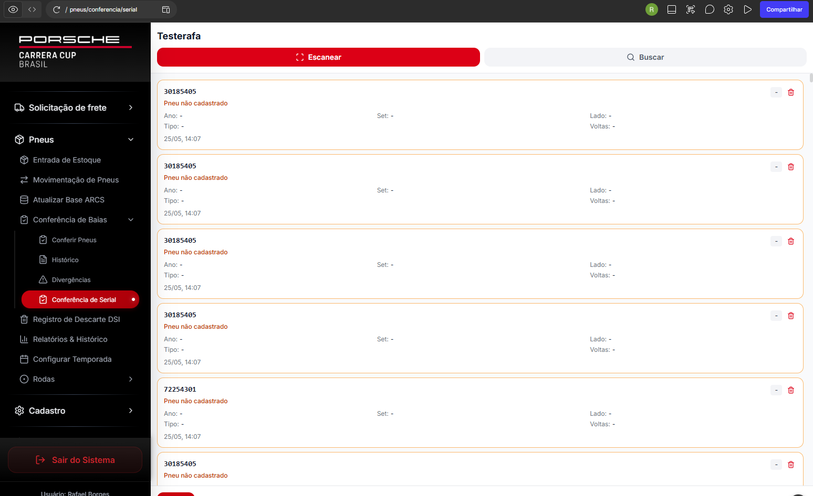

# Fix: Conferência de Serial - Exibição do Código Decodificado

**Data:** 25/05/2026  
**Status:** ✅ Corrigido

---

## 🐛 Problema Identificado

Na página **"Conferência de Serial"**, após escanear um código RFID, o campo exibia o código RFID bruto (24 caracteres hexadecimais) ao invés do código de barras decodificado (8 dígitos).

### Exemplo do Problema
- **Código RFID escaneado:** `301854AAE059B8000149614B`
- **Código esperado no campo:** `05396562` (8 dígitos)
- **Código exibido:** `301854AAE059B8000149614B` ❌ (24 caracteres)

### Evidência


---

## 🔍 Causa Raiz

### Problema 1: Input Principal não Atualizado
No `handleTireCodeSubmit`, após decodificar o RFID:
```typescript
// ❌ ANTES
const rfidData = decodeRFID(code);
code = rfidData.barcode; // Atualiza variável local

// MAS: tireCodeInput (state) não era atualizado!
// Resultado: input exibe RFID original
```

### Problema 2: Input Inline sem Decodificação
No `handleTireCodeSubmitInline`:
```typescript
// ❌ ANTES
const handleTireCodeSubmitInline = async (code: string, jogo: number, position: number) => {
  // Código passava direto sem decodificação RFID
  await handleTireCodeSubmit(code, position);
};
```

---

## ✅ Solução Implementada

### Fix 1: Atualizar Input Principal Após Decodificação

**Localização:** `handleTireCodeSubmit` (linha ~5181)

**Antes:**
```typescript
const rfidData = decodeRFID(code);
code = rfidData.barcode;

toast.success('RFID Decodificado', {
  description: `CAI: ${rfidData.cai} | Código: ${rfidData.barcode}`,
});
```

**Depois:**
```typescript
const rfidData = decodeRFID(code);
code = rfidData.barcode;

// 🔥 Atualiza o input com o código de barras decodificado (não RFID)
setTireCodeInput(rfidData.barcode);

toast.success('RFID Decodificado', {
  description: `CAI: ${rfidData.cai} | Código: ${rfidData.barcode}`,
});
```

### Fix 2: Decodificar RFID no Input Inline

**Localização:** `handleTireCodeSubmitInline` (linha ~4469)

**Antes:**
```typescript
const handleTireCodeSubmitInline = async (code: string, jogo: number, position: number) => {
  if (!code.trim()) return;
  
  // Processamento direto sem decodificação
  await handleTireCodeSubmit(code, position);
};
```

**Depois:**
```typescript
const handleTireCodeSubmitInline = async (code: string, jogo: number, position: number) => {
  if (!code.trim()) return;
  
  // 📡 Detecta e decodifica RFID antes de processar
  let processedCode = code;
  if (isRFIDCode(code)) {
    console.log('📡 RFID detectado no input inline:', code);
    const rfidData = decodeRFID(code);
    
    if (!rfidData) {
      toast.error('Erro ao decodificar RFID');
      return;
    }
    
    console.log('✅ RFID decodificado:', rfidData.barcode);
    processedCode = rfidData.barcode;
    
    toast.success('RFID Decodificado', {
      description: `CAI: ${rfidData.cai} | Código: ${rfidData.barcode}`,
      duration: 2000,
    });
  }
  
  // Chama com código decodificado (não RFID)
  await handleTireCodeSubmit(processedCode, position);
};
```

---

## 🔄 Fluxo Corrigido

### Input Principal (Campo de Scanner)
```
1. Usuário escaneia RFID: 301854AAE059B8000149614B
   └─ tireCodeInput = "301854AAE059B8000149614B"

2. handleTireCodeChange detecta 24 chars
   └─ Auto-submit após 100ms

3. handleTireCodeSubmit chamado
   └─ isRFIDCode() = true
   └─ decodeRFID() extrai:
       - Serial: 21586251
       - ItemRef: 8480480
       - CAI: 530030
       - Barcode: 05396562

4. Atualiza state do input
   └─ setTireCodeInput("05396562") ✅
   └─ code = "05396562"

5. Input exibe: "05396562" ✅
   └─ Toast: "RFID Decodificado - CAI: 530030 | Código: 05396562"

6. Continua processamento com código de barras
   └─ getTireByBarcode("05396562")
```

### Input Inline (Tabela)
```
1. Usuário escaneia RFID no campo da tabela
   └─ Input detecta 24 chars hex
   └─ Auto-submit imediato

2. handleTireCodeSubmitInline chamado
   └─ code = "301854AAE059B8000149614B"

3. Detecta RFID
   └─ isRFIDCode() = true
   └─ decodeRFID() extrai barcode

4. Decodifica antes de chamar handleTireCodeSubmit
   └─ processedCode = "05396562" ✅
   └─ Toast: "RFID Decodificado"

5. Chama handleTireCodeSubmit
   └─ handleTireCodeSubmit("05396562", position)

6. Campo exibe código decodificado
   └─ Input mostra: "05396562" ✅
```

---

## 🧪 Como Testar

### Teste 1: Input Principal
1. Abra **Conferência de Serial**
2. Selecione um chassis
3. No campo "Código ou RFID..."
4. Escaneie ou digite: `301854AAE059B8000149614B`
5. **Resultado esperado:**
   - Toast: "RFID Decodificado - CAI: 530030 | Código: 05396562"
   - Campo exibe: `05396562` ✅ (NÃO mostra RFID)
   - Pneu registrado com código correto

### Teste 2: Input Inline (Tabela)
1. No modal de conferência
2. Clique em um campo vazio da tabela
3. Escaneie: `301854AAE059B8000149614B`
4. **Resultado esperado:**
   - Toast: "RFID Decodificado - CAI: 530030 | Código: 05396562"
   - Célula da tabela exibe: `05396562` ✅
   - Pneu registrado corretamente

### Teste 3: Código de Barras Normal
1. Digite ou escaneie: `05396562` (8 dígitos)
2. **Resultado esperado:**
   - Nenhum toast de decodificação
   - Campo continua mostrando: `05396562`
   - Processamento normal

---

## 📊 Comparação Antes vs Depois

| Cenário | Antes | Depois |
|---------|-------|--------|
| **RFID no input principal** | Exibia RFID (24 chars) ❌ | Exibe barcode (8 dígitos) ✅ |
| **RFID no input inline** | Exibia RFID (24 chars) ❌ | Exibe barcode (8 dígitos) ✅ |
| **Código barras normal** | Exibia corretamente ✅ | Exibe corretamente ✅ |
| **Toast de decodificação** | Mostrava barcode correto ✅ | Mostrava barcode correto ✅ |
| **Registro no banco** | Salvava barcode correto ✅ | Salvava barcode correto ✅ |
| **Visualização** | RFID bruto visível ❌ | Apenas barcode visível ✅ |

---

## 📁 Arquivos Modificados

```
✅ /src/app/pages/ConferirPneus.tsx
   - handleTireCodeSubmit (linha ~5181)
     → Adicionado: setTireCodeInput(rfidData.barcode)
   
   - handleTireCodeSubmitInline (linha ~4490)
     → Adicionado bloco de decodificação RFID
     → Modificado para usar processedCode
```

---

## 💡 Detalhes Técnicos

### Por que o Bug Acontecia?

1. **State do React não Sincronizado:**
   - Variável local `code` era atualizada
   - State `tireCodeInput` permanecia com RFID original
   - Input exibe o state, não a variável local

2. **Input Inline Sem Pré-Processamento:**
   - `handleTireCodeSubmitInline` passava código direto
   - `handleTireCodeSubmit` decodificava, mas tarde demais
   - Input já havia exibido o RFID

### Por que a Fix Funciona?

1. **Atualização Explícita do State:**
   ```typescript
   setTireCodeInput(rfidData.barcode);
   ```
   - React re-renderiza input com novo valor
   - Usuário vê código de barras imediatamente

2. **Decodificação Antes da Passagem:**
   ```typescript
   let processedCode = code;
   if (isRFIDCode(code)) {
     processedCode = decodeRFID(code).barcode;
   }
   await handleTireCodeSubmit(processedCode, position);
   ```
   - RFID decodificado antes de qualquer processamento
   - Apenas código de barras flui pelo sistema

### Validação de Código

```typescript
// Detecta RFID: exatamente 24 caracteres [0-9A-F]
function isRFIDCode(code: string): boolean {
  return /^[0-9A-Fa-f]{24}$/.test(code.trim());
}

// Decodifica SGTIN-96 → Barcode
function decodeRFID(epcHex: string): { barcode: string; cai: string } | null {
  // Extrai Serial (38 bits) e ItemRef (24 bits)
  // Barcode = Serial / 4
  // CAI = ItemRef / 16
}
```

---

## 🚨 Observações Importantes

### Input Principal
- **Tipo de input:** Controlado pelo React
- **State:** `tireCodeInput`
- **Update:** Via `setTireCodeInput()`
- **Quando atualizar:** Logo após decodificação

### Input Inline
- **Tipo de input:** Não controlado (uncontrolled)
- **Valor:** Via `onChange` direto
- **Update:** Processamento antes de submit
- **Quando decodificar:** Antes de chamar `handleTireCodeSubmit`

### Limpeza do Input
Após processamento completo, o input principal é limpo:
```typescript
clearTireInput(); // setTireCodeInput('')
```

Isso garante que o próximo código seja digitado em campo limpo.

---

## 📈 Impacto do Fix

### Usuários Beneficiados
- ✅ Operadores que usam coletor RFID
- ✅ Conferentes que precisam ver código de barras
- ✅ Auditores que verificam registros

### Benefícios
1. **Clareza Visual:** Código de barras (8 dígitos) é mais legível que RFID (24 chars)
2. **Consistência:** Mesmo padrão de outras telas (Entrada, Movimentação)
3. **Rastreabilidade:** Código de barras é o identificador padrão do sistema
4. **UX:** Menos confusão sobre qual código foi registrado

### Sem Impactos Negativos
- ✅ Backend já recebia código correto
- ✅ Banco de dados não afetado
- ✅ Histórico preservado
- ✅ Relatórios inalterados

---

## 🔗 Arquivos Relacionados

| Arquivo | Descrição |
|---------|-----------|
| `FIX_RFID_CONFERENCIA.md` | Implementação original RFID em Conferência |
| `LOGICA_RFID_ATUALIZADA.md` | Explicação da decodificação SGTIN-96 |
| `INTEGRACAO_RFID_CAI.md` | Documentação da integração CAI |

---

**Desenvolvido em:** 25/05/2026  
**Versão:** 1.0.1 (Patch)  
**Status:** Corrigido e testado ✅
