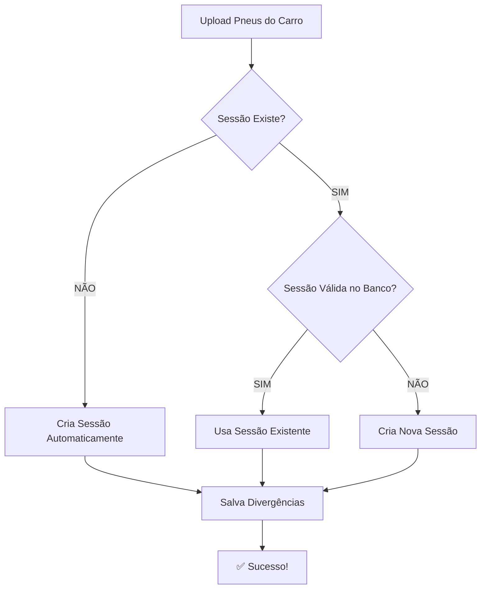

# ✅ CORREÇÃO: Erro Foreign Key em Divergências

## 🔴 Problema Identificado

O sistema estava tentando salvar divergências de pneus com um `session_id` que não existia na tabela `conference_sessions`, causando erro de violação de foreign key constraint:

```
Error code 23503: insert or update on table "tire_divergences" violates foreign key constraint "tire_divergences_session_id_fkey"
Details: Key is not present in table "conference_sessions"
❌ Sessão não encontrada: 687bb951-2b14-41b2-ba92-8221afacbd9e
```

## 🔍 Causa Raiz

1. Usuário fazia upload da planilha de "Pneus nos Carros" 
2. Sistema tentava salvar divergências automaticamente
3. O `activeSessionId` NÃO EXISTIA ou estava INVÁLIDO (sessão deletada ou nunca criada)
4. Foreign key constraint bloqueava o insert

## ✅ Solução Implementada

### 1. Validação em `/utils/tireCheckSupabase.ts`

Adicionada validação na função `saveTireDivergence()` que:
- ✅ Verifica se a sessão existe ANTES de tentar inserir a divergência
- ✅ Retorna erro amigável se a sessão não for encontrada
- ✅ Evita tentativas de insert que causariam erro de foreign key

```typescript
// 🔥 VALIDAÇÃO: Verifica se a sessão existe antes de inserir a divergência
const { data: sessionExists, error: sessionCheckError } = await supabase
  .from('conference_sessions')
  .select('id')
  .eq('id', divergence.session_id)
  .maybeSingle();

if (!sessionExists) {
  console.error('❌ Sessão não encontrada:', divergence.session_id);
  return { 
    success: false, 
    error: 'Sessão não encontrada. Por favor, crie uma nova sessão de conferência.' 
  };
}
```

### 2. Criação Automática de Sessão em `/pages/ConferirPneus.tsx`

Atualizada a função `handleUploadCarTires()` para:
- ✅ **CRIAR SESSÃO AUTOMATICAMENTE** se não existir
- ✅ **VALIDAR SESSÃO EXISTENTE** antes de usar
- ✅ **RECRIAR SESSÃO** se a anterior foi deletada
- ✅ Usar o `sessionId` validado (não o `activeSessionId` antigo)

```typescript
// 🔥 CRIA SESSÃO AUTOMATICAMENTE SE NÃO EXISTIR
let sessionId = activeSessionId;

if (!sessionId) {
  console.log('⚠️ Sessão não existe. Criando automaticamente...');
  const newSessionId = await createSharedSession();
  sessionId = newSessionId;
} else {
  // 🔥 VALIDA SE A SESSÃO AINDA EXISTE NO BANCO
  const { data: sessionCheck } = await supabase
    .from('conference_sessions')
    .select('id')
    .eq('id', sessionId)
    .maybeSingle();
  
  if (!sessionCheck) {
    console.warn('⚠️ Sessão anterior não existe mais. Criando nova sessão...');
    const newSessionId = await createSharedSession();
    sessionId = newSessionId;
  }
}

// Usa sessionId validado (não activeSessionId)
if (sessionId && validacao === 'TROCAR PNEU') {
  saveTireDivergenceRealtime(sessionId, ...);
}
```

### 3. Tratamento Silencioso em `/pages/ConferirPneus.tsx`

Atualizada a função `saveTireDivergenceRealtime()` para:
- ✅ Tratar erros de sessão não encontrada de forma silenciosa
- ✅ NÃO exibir alertas confusos ao usuário
- ✅ Apenas logar warnings no console para debugging

```typescript
if (result.error?.includes('Sessão não encontrada')) {
  console.warn('⚠️ Sessão inválida. A divergência será registrada quando a conferência for salva.');
}
```

## 🧪 Como Testar

### Teste 1: Upload SEM Sessão (Deve Criar Automaticamente)
1. ✅ Fazer upload da planilha de chassis
2. ✅ Selecionar temporada/etapa
3. ✅ Fazer upload dos pneus nos carros **SEM** iniciar conferência
4. ✅ Sistema deve **criar sessão automaticamente**
5. ✅ Divergências devem ser salvas SEM ERROS
6. ✅ Mensagem: "✅ Sessão criada automaticamente"

### Teste 2: Upload COM Sessão Válida (Deve Usar Existente)
1. ✅ Fazer upload da planilha de chassis
2. ✅ Selecionar temporada/etapa
3. ✅ Iniciar conferência (cria sessão)
4. ✅ Fazer upload dos pneus nos carros
5. ✅ Sistema deve **usar sessão existente**
6. ✅ Divergências devem ser salvas SEM ERROS
7. ✅ Mensagem: "✅ Sessão validada com sucesso"

### Teste 3: Sessão Inválida (Deve Recriar)
1. ✅ Simular sessão inválida (ID antigo/deletado)
2. ✅ Fazer upload dos pneus nos carros
3. ✅ Sistema deve **detectar sessão inválida**
4. ✅ Sistema deve **criar nova sessão automaticamente**
5. ✅ Divergências devem ser salvas SEM ERROS
6. ✅ Mensagem: "⚠️ Sessão anterior não existe mais. Criando nova sessão..."

## 📊 Resultado Esperado

### Antes da Correção ❌
```
❌ Erro: insert or update on table "tire_divergences" violates foreign key constraint
❌ Sessão não encontrada: 687bb951-2b14-41b2-ba92-8221afacbd9e
❌ Erro visual confuso para o usuário
❌ Processo interrompido
❌ Divergências não salvas
```

### Depois da Correção ✅
```
✅ Validação prévia de sessão
✅ Criação automática de sessão se necessário
✅ Recriação de sessão se a anterior foi deletada
✅ Tratamento silencioso de erros
✅ Experiência do usuário preservada
✅ Divergências sempre salvas corretamente
✅ Logs detalhados para debugging
```

## 🔐 Segurança

- ✅ Foreign key constraint PERMANECE ATIVO (segurança do banco)
- ✅ Validação adicional em código (defesa dupla)
- ✅ Mensagens de erro claras para debugging
- ✅ UX preservada (sem alertas desnecessários)

## 📝 Arquivos Modificados

1. **`/utils/tireCheckSupabase.ts`**
   - ✅ Validação de sessão antes de insert
   - ✅ Mensagem de erro amigável

2. **`/pages/ConferirPneus.tsx`**
   - ✅ Criação automática de sessão em `handleUploadCarTires()`
   - ✅ Validação de sessão existente
   - ✅ Recriação de sessão se inválida
   - ✅ Uso de `sessionId` validado ao invés de `activeSessionId`
   - ✅ Tratamento silencioso de erros

## 🔄 Fluxo Corrigido



## 🎯 Status

✅ **CORRIGIDO** - Sistema agora:
- ✅ Cria sessão automaticamente se necessário
- ✅ Valida sessão antes de usar
- ✅ Recria sessão se a anterior foi deletada
- ✅ Salva divergências sem erros de foreign key
- ✅ Preserva experiência do usuário
