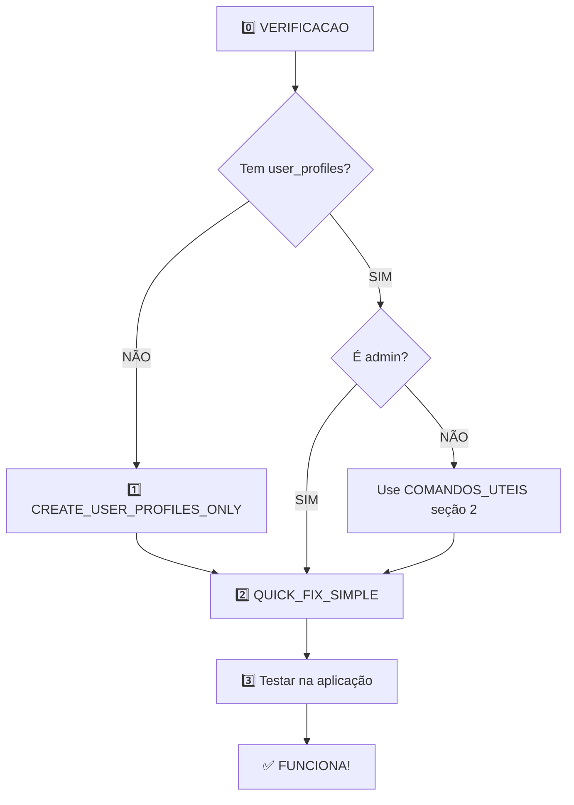

# 🚀 COMECE AQUI - Você já tem access_profiles

## ⚡ SOLUÇÃO MAIS RÁPIDA (1 arquivo só!)

### **Opção A: Executar tudo de uma vez** ⭐ **RECOMENDADO**

Execute apenas este arquivo:

```
📁 EXECUTAR_TUDO_DE_UMA_VEZ.sql
```

**O que faz:**
- ✅ Cria tabela `user_profiles`
- ✅ Atribui perfil admin ao primeiro usuário
- ✅ Aplica policies corretas em `geracao` e `chassis`
- ✅ Mostra relatório final
- ⚡ **TUDO EM 1 EXECUÇÃO!**

**Depois:**
1. Recarregue a aplicação (F5)
2. Teste editar uma geração
3. ✅ Funciona!

---

## 📝 Solução Passo a Passo (se preferir controlar cada etapa)

### **PASSO 0: Verificar situação atual** *(Opcional mas recomendado)*

Execute este arquivo para ver o que você precisa fazer:

```
📁 00_VERIFICACAO_ANTES_DE_EXECUTAR.sql
```

**O que mostra:**
- ✅ Quais tabelas existem
- 📊 Quantos registros tem
- 👤 Quais usuários são admin
- 🎯 Qual arquivo você deve executar

---

### **PASSO 1: Criar user_profiles**

Execute:
```
📁 CREATE_USER_PROFILES_ONLY.sql
```

**Resultado esperado:**
```
✅ Tabela user_profiles criada
✅ Você recebeu perfil admin
✅ Mostra relatório com perfis e usuários
```

---

### **PASSO 2: Aplicar policies de segurança**

Execute:
```
📁 QUICK_FIX_SIMPLE.sql
```

**Resultado esperado:**
```
Success. No rows returned
```
*(Isso é bom! Significa que funcionou)*

---

### **PASSO 3: Testar**

1. **Recarregue a aplicação** (F5)
2. Vá para **Master Data > Carros > Geração**
3. Clique em **✏️ Editar**
4. Altere algo
5. Clique em **Atualizar**
6. ✅ **Deve funcionar!**

---

## 📁 Arquivos Importantes

| Arquivo | Para que serve | Quando usar |
|---------|----------------|-------------|
| `00_VERIFICACAO_ANTES_DE_EXECUTAR.sql` | 🔍 Ver o que você precisa fazer | **Execute PRIMEIRO** |
| `CREATE_USER_PROFILES_ONLY.sql` | 🔧 Criar tabela user_profiles | Se você **não tem** user_profiles |
| `QUICK_FIX_SIMPLE.sql` | 🔒 Aplicar policies corretas | **Depois** de criar user_profiles |
| `COMANDOS_UTEIS.sql` | 🛠️ Comandos administrativos | Para troubleshooting |
| `GUIA_RAPIDO_COM_ACCESS_PROFILES.md` | 📖 Guia detalhado | Ler se tiver dúvidas |

---

## 🎯 Ordem de Execução



---

## 🆘 Troubleshooting

### **Erro: "relation public.user_profiles does not exist"**
✅ **Solução:** Execute `CREATE_USER_PROFILES_ONLY.sql`

### **Erro: "permission denied for table user_profiles"**
✅ **Solução:** Execute esta query:
```sql
GRANT SELECT ON public.user_profiles TO authenticated;
GRANT SELECT ON public.access_profiles TO authenticated;
```

### **Erro: "new row violates row-level security policy"**
✅ **Causa:** Você não é admin  
✅ **Solução:** Use `COMANDOS_UTEIS.sql` seção 2 para se atribuir perfil admin

### **Ainda não funciona?**
✅ **Solução temporária:** Execute `QUICK_FIX_TEMP.sql`
- Permite que **todos** possam editar (temporário)
- Use enquanto investiga o problema

---

## ✅ Checklist Rápido

```
[ ] Executei 00_VERIFICACAO_ANTES_DE_EXECUTAR.sql
[ ] Vi que tenho access_profiles ✅
[ ] Vi que NÃO tenho user_profiles ❌
[ ] Executei CREATE_USER_PROFILES_ONLY.sql
[ ] Vi que agora sou admin ✅
[ ] Executei QUICK_FIX_SIMPLE.sql
[ ] Recarreguei a aplicação (F5)
[ ] Testei editar geração
[ ] ✅ FUNCIONA!
```

---

## 💡 Dica

**Se você tem pouco tempo:**
1. Execute `CREATE_USER_PROFILES_ONLY.sql`
2. Execute `QUICK_FIX_SIMPLE.sql`
3. Recarregue e teste

**Pronto em 2 minutos!** ⚡

---

## 📞 Suporte

Se mesmo seguindo todos os passos não funcionar:

1. Execute `00_VERIFICACAO_ANTES_DE_EXECUTAR.sql`
2. Copie o output
3. Execute `COMANDOS_UTEIS.sql` seção 10 (Troubleshooting)
4. Copie o output
5. Mostre os dois outputs para debug

---

**Vamos lá! Execute o passo 0 e veja o que você precisa fazer! 🚀**